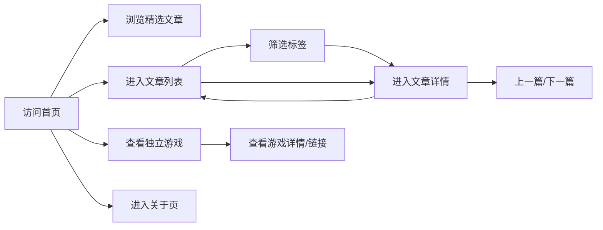

# 产品需求文档（PRD）

## 1. 产品概述

本项目为基于 GitHub Pages 部署的静态个人博客站，面向开发者、独立游戏创作者与创作者群体，用于展示文章、手记、思考、个人信息以及独立游戏作品。

- 目标用户：技术写作者、独立游戏开发者、希望拥有简洁现代个人主页的创作者。
- 产品价值：在无需后端与数据库的前提下，提供一个可本地撰写 Markdown、展示独立游戏项目、构建后一键部署的轻量博客方案。

## 2. 核心功能

### 2.1 用户角色

| 角色 | 说明 | 权限 |
|------|------|------|
| 访客 | 无需注册 | 浏览首页、文章列表、文章详情、游戏作品与关于页面 |
| 博主 | 仓库协作者 | 通过修改 Markdown 与数据文件并重新构建更新站点内容 |

### 2.2 功能模块

1. **首页**：个人简介、精选文章、独立游戏作品入口、最新动态、页脚链接。
2. **文章列表页**：按时间倒序展示全部文章，支持按标签筛选。
3. **文章详情页**：Markdown 渲染、文章元信息、浏览量、点赞、上一篇/下一篇导航。
4. **游戏页**：展示独立游戏作品，包含封面、简介、技术栈、平台、浏览量、点赞与链接。
5. **留言板页**：访客可提交昵称与留言，实时展示所有留言。
6. **关于页**：个人介绍、独立游戏开发经历、社交链接、时间线/经历。
7. **404 页面**：友好提示与返回首页入口。

### 2.3 页面详情

| 页面名称 | 模块名称 | 功能描述 |
|----------|----------|----------|
| 首页 | Hero 区域 | 展示站点标题、一句话签名、个人头像与背景氛围 |
| 首页 | 精选文章 | 展示 3 篇推荐文章卡片 |
| 首页 | 独立游戏 | 展示 2-3 个精选独立游戏项目入口 |
| 首页 | 最新动态 | 展示最近发布的简短手记/思考片段 |
| 首页 | 页脚 | 版权信息、社交图标、RSS 链接 |
| 文章列表页 | 筛选栏 | 按标签筛选，显示文章总数 |
| 文章列表页 | 文章卡片 | 标题、摘要、日期、标签、阅读时长 |
| 文章详情页 | 内容区 | Markdown 渲染，代码高亮 |
| 文章详情页 | 元信息 | 标题、日期、标签、阅读时长、浏览量、点赞 |
| 文章详情页 | 文章导航 | 上一篇、下一篇、返回列表 |
| 游戏页 | 作品网格 | 游戏封面、名称、类型、技术栈、简介、平台标签、浏览量、点赞 |
| 游戏页 | 筛选栏 | 按平台/引擎筛选，显示作品总数 |
| 留言板页 | 留言表单 | 昵称、留言内容、字数限制、提交反馈 |
| 留言板页 | 留言列表 | 按时间倒序展示，显示昵称、内容与日期 |
| 关于页 | 个人简介 | 头像、昵称、职业（含独立游戏开发者）、所在地 |
| 关于页 | 时间线 | 经历/里程碑时间轴，含游戏开发节点 |

## 3. 核心流程

访客打开站点后进入首页，可点击导航进入文章列表、游戏作品或关于页面；在文章列表中可筛选标签并进入文章详情；文章详情页提供前后篇导航；游戏页展示独立游戏作品集；整个站点为静态构建，博主通过修改仓库中的 Markdown 文件与数据文件并重新构建部署来更新内容。

## 4. 用户界面设计

### 4.1 设计风格

- **整体调性**：现代、克制、温暖，参考 Mix Space 文档站的清晰层级与留白，融合杂志编辑感与独立游戏的像素/复古细节。
- **主色调**：以柔和的米白/浅灰作为背景（`#FAF9F7`），深色文字（`#1C1917`），辅以暖棕色（`#8B5E3C`）作为强调色。
- **按钮样式**：小圆角（6px）、细边框、hover 时背景色过渡。
- **字体**：
  - 标题：有衬线字体（如思源宋体 / Noto Serif SC），营造书卷气。
  - 正文：无衬线字体（如霞鹜文楷 / LXGW WenKai 或系统字体），提升可读性。
- **布局**：顶部固定导航 + 主内容区 + 底部页脚；卡片式文章与作品展示； generous 留白。
- **图标/emoji**：使用 `lucide-react` 线性图标，保持克制；少量像素风装饰或手柄/骰子等游戏元素点缀。

### 4.2 页面设计概览

| 页面名称 | 模块名称 | UI 元素 |
|----------|----------|---------|
| 首页 | Hero | 左对齐大标题、副标题、头像、渐变氛围背景 |
| 首页 | 精选文章 | 三列网格卡片、悬停阴影、缩略图占位 |
| 首页 | 独立游戏 | 两列/三列作品卡片、封面占位、技术栈标签 |
| 首页 | 最新动态 | 时间线式列表、日期标签 |
| 文章列表 | 筛选栏 | 标签胶囊、搜索图标、文章计数 |
| 文章列表 | 文章卡片 | 横向卡片、左侧日期、右侧标题摘要标签 |
| 文章详情 | 内容区 | 居中窄栏、Markdown 渲染、代码块 |
| 游戏页 | 作品网格 | 卡片、渐变占位封面、平台标签、引擎标签 |
| 关于 | 个人简介 | 头像、名称、描述、社交链接 |
| 关于 | 时间线 | 垂直时间轴、节点高亮 |

### 4.3 响应式适配

- **桌面优先**：最大内容宽度 1200px，Hero 区域使用双栏布局。
- **平板/手机**：导航折叠为汉堡菜单，网格变为单列，字号适当缩小。
- **触屏优化**：按钮与链接点击区域不小于 44px，卡片整体可点击。

## 5. 内容示例

- 站点标题：示例为「墨白集」或用户后续自定义。
- 默认包含 3 篇示例 Markdown 文章、1 篇关于页内容与 2-3 个示例独立游戏项目，方便用户直接替换。

## 6. 非功能需求

- **性能**：首屏关键资源优化，构建产物支持懒加载图片与代码分割。
- **SEO**：每个页面设置独立 title、description 与语义化 HTML。
- **可访问性**：合理使用 ARIA 标签，确保键盘可导航，颜色对比度符合 WCAG AA。
- **部署**：产物为纯静态 HTML/JS/CSS，可直接部署到 GitHub Pages。
