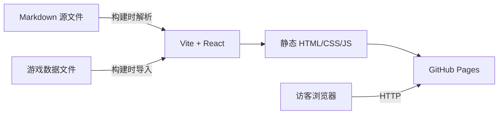

# 技术架构文档

## 1. 架构设计

本项目为纯前端静态站点，无需后端服务与数据库。Markdown 源文件与独立游戏数据在构建时被解析为数据，React 组件渲染为 HTML，最终产物部署到 GitHub Pages。



## 2. 技术选型

- **前端框架**：React 18 + TypeScript
- **构建工具**：Vite 5
- **样式方案**：Tailwind CSS 3
- **路由**：react-router-dom（HashRouter，适配 GitHub Pages 静态部署）
- **图标库**：lucide-react
- **Markdown 渲染**：react-markdown + remark-gfm
- **代码高亮**：react-syntax-highlighter（Prism 主题）
- **后端/数据库**：Firebase Realtime Database（用于访客留言、浏览量、点赞等动态数据）
- **状态管理**：无需全局状态管理库，使用 React 内置 hooks 即可
- **部署目标**：GitHub Pages（纯静态文件）

## 3. 项目结构

```
d:\githubpage
├── .trae\documents\        # PRD 与技术文档
├── public\                  # 静态资源（头像、图片、 favicon 等）
├── src\
│   ├── components\          # 可复用组件
│   ├── data\                # Markdown 文章、博主信息与游戏数据
│   ├── hooks\               # 自定义 hooks
│   ├── pages\               # 页面组件
│   ├── styles\              # 全局样式与字体
│   ├── utils\               # 工具函数
│   ├── App.tsx             # 路由与布局
│   └── main.tsx            # 应用入口
├── index.html
├── package.json
├── tailwind.config.js
├── tsconfig.json
└── vite.config.ts
```

## 4. 路由定义

| 路由 | 用途 |
|------|------|
| `/` | 首页 |
| `/posts` | 文章列表页 |
| `/posts/:slug` | 文章详情页 |
| `/games` | 独立游戏展示页 |
| `/guestbook` | 留言板页 |
| `/about` | 关于页 |
| `*` | 404 页面 |

由于部署在 GitHub Pages，使用 `HashRouter` 避免刷新 404 问题。

## 5. 数据模型

### 5.1 文章元数据

```typescript
interface Post {
  slug: string;          // URL 路径标识
  title: string;         // 文章标题
  date: string;          // 发布日期（ISO 8601）
  summary: string;       // 文章摘要
  tags: string[];        // 标签数组
  featured?: boolean;    // 是否精选
  readingTime: number;   // 阅读时长（分钟）
  content: string;       // Markdown 正文
}
```

### 5.2 博主信息

```typescript
interface Author {
  name: string;
  avatar: string;
  bio: string;
  location: string;
  social: {
    github?: string;
    twitter?: string;
    email?: string;
    rss?: string;
  };
}
```

### 5.3 时间线项

```typescript
interface TimelineItem {
  year: string;
  title: string;
  description: string;
}
```

### 5.4 独立游戏作品

```typescript
interface Game {
  id: string;            // 唯一标识
  title: string;         // 游戏名称
  genre: string;         // 游戏类型
  summary: string;       // 简短介绍
  description: string;   // 详细描述
  engine: string;        // 游戏引擎
  platforms: string[];   // 平台（PC / Web / Mobile 等）
  techStack: string[];   // 技术栈
  cover: string;         // 封面图 URL
  demoUrl?: string;      // 试玩/演示链接
  repoUrl?: string;      // 代码仓库链接
  featured?: boolean;    // 是否精选展示
  releaseDate?: string;  // 发布日期
}
```

### 5.5 Firebase Realtime Database 数据结构

```json
{
  "views": {
    "posts": {
      "{slug}": 100
    },
    "games": {
      "{id}": 50
    }
  },
  "likes": {
    "posts": {
      "{slug}": 20
    },
    "games": {
      "{id}": 15
    }
  },
  "guestbook": {
    "{pushId}": {
      "name": "访客昵称",
      "message": "留言内容",
      "createdAt": 1234567890
    }
  }
}
```

### 5.6 本地状态说明

- 浏览量使用 `sessionStorage` 去重，同一次会话内多次访问只计数一次。
- 点赞状态使用 `localStorage` 记录，用户可切换点赞/取消点赞。

## 6. Markdown 处理方案

- 每篇文章对应一个 `.md` 文件，位于 `src/data/posts/`。
- 文章顶部使用 YAML frontmatter 存储元数据。
- 构建时通过 Vite 的 `?raw` import 读取 Markdown 字符串，使用 `gray-matter` 解析 frontmatter，正文交由 `react-markdown` 渲染。
- 代码块使用 `react-syntax-highlighter` 进行高亮。

## 7. Firebase 安全规则

由于本站点没有用户登录，Firebase Realtime Database 需要允许匿名读写。部署前请在 Firebase 控制台设置规则：

```json
{
  "rules": {
    "views": {
      "$contentType": {
        "$id": {
          ".read": true,
          ".write": true
        }
      }
    },
    "likes": {
      "$contentType": {
        "$id": {
          ".read": true,
          ".write": true
        }
      }
    },
    "guestbook": {
      "$messageId": {
        ".read": true,
        ".write": true,
        ".validate": "newData.hasChildren(['name', 'message', 'createdAt'])"
      }
    }
  }
}
```

> 注意：公开写权限存在被滥用的风险。如果后期访问量较大，建议增加速率限制、验证码或切换到需要登录的 Firebase Auth 方案。

## 8. 构建与部署

- 本地开发：`npm run dev`
- 生产构建：`npm run build`
- 构建产物位于 `dist/`，可直接作为 GitHub Pages 源目录。
- 部署方式：将 `dist/` 内容推送至仓库的 `gh-pages` 分支，或配置 GitHub Actions 自动构建部署。
